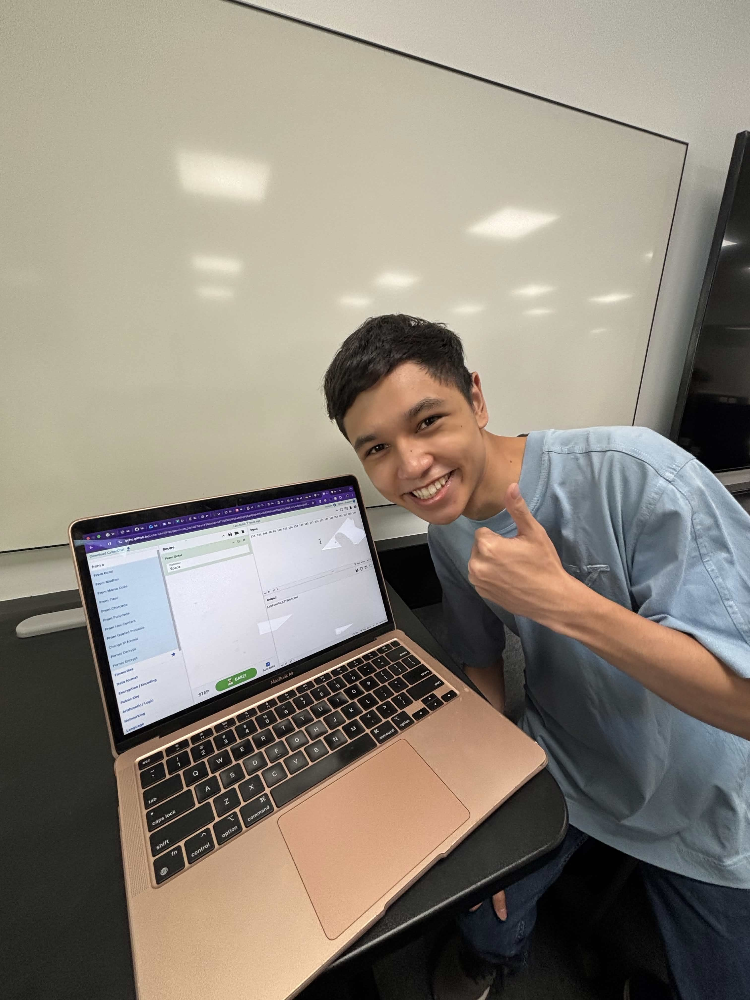
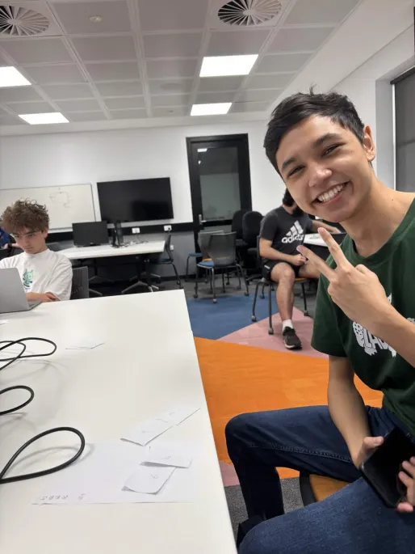
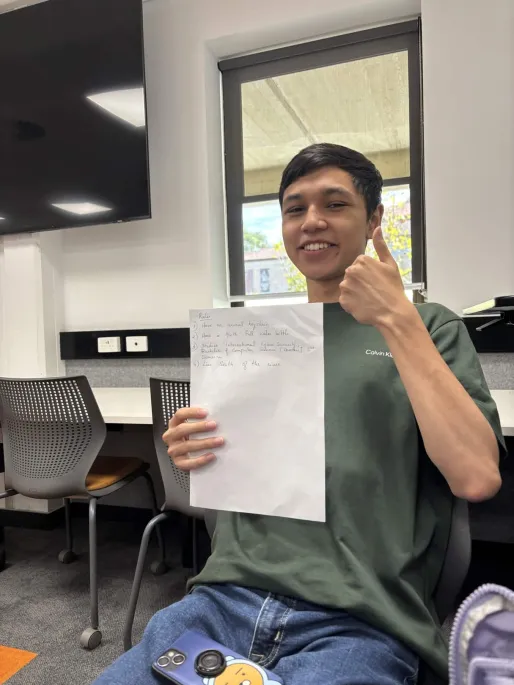

# **Part 2**
In Order of Completion

---

**B4. Participate in 3 in-class activities in labs (facilitators will administer such activities).**

Lab 1: Hashing and Blockchain
<head>
 
 
 
</head>

Solving the ciphers made by other students using CyberChef